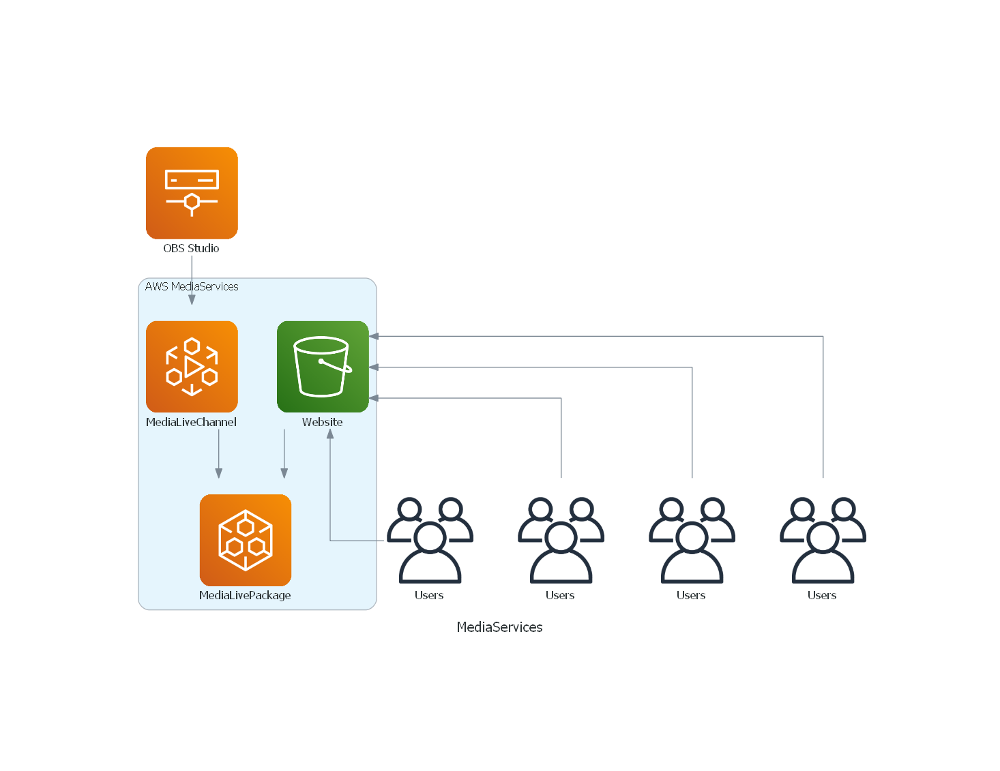
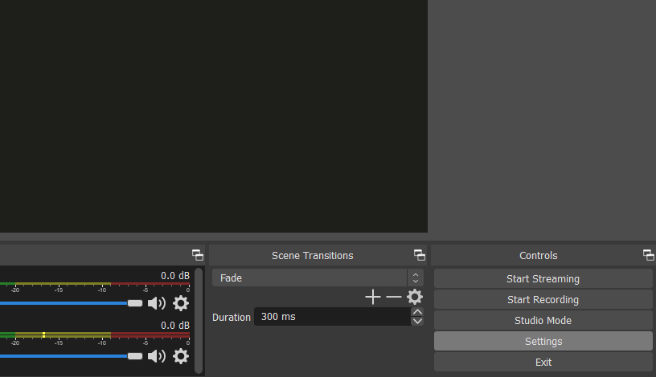
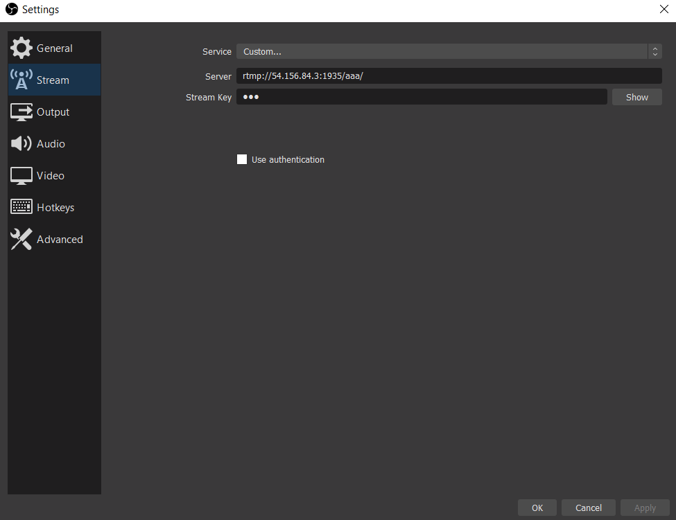
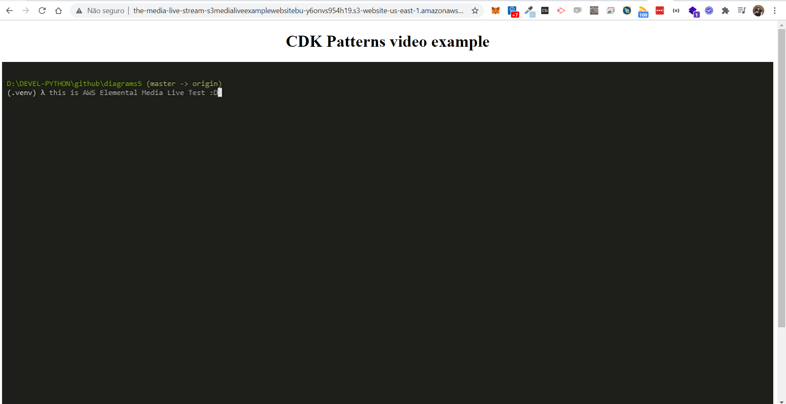
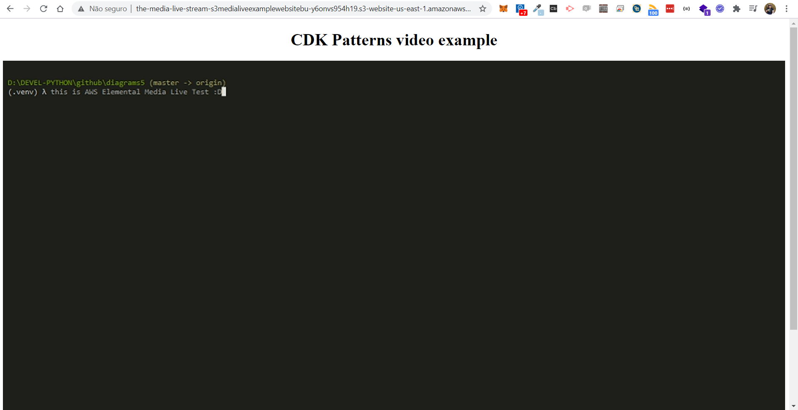
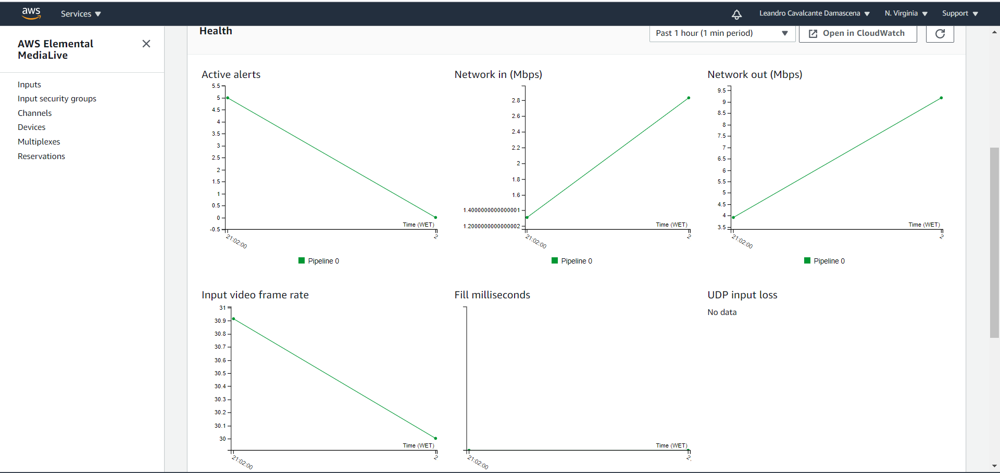

# The Media Live Stream

This is an example of how to deploy a Serverless environment to stream live event content.



## Warnings
1. This CDK stack doesn't automatically start its medialive channel. AWS charges for a medialive "live/started" channel whether you are using it or not, so you must start manually using Console, CLI or SDK. Check prices here: https://aws.amazon.com/medialive/pricing/    
2. This CDK stack is just to demonstrate how to create a Serverless broadcast enviroment, so I wrote using a single channel and 2 high definitions. If you need to deploy it in production, I suggest that you learn more about AWS MediaLive Services here: https://www.aws.training/LearningLibrary?filters=language%3A1&filters=classification%3A75&tab=view_all  
3. Don't forget your medialive channel opened, AWS will charge you!   
4. You can attach a CloudFront to the MediaPackage distribution or set S3 as backup of medialive stream. In the future I'll update this stack.  
5. If you have some doubts about MediaLive Services, feel free to send me a message (https://github.com/leandrodamascena).
6. Before destroying this Stack, you must stop your LiveChannel, otherwise CloudFormation will generate an error.

## Commands

This stack uses assets so you must run `cdk bootstrap account/region` before run the other commands. 

Due to this CDK Pattern deploy a website with output values, it was splitted in 2 stacks.


### First Stack
The main stack is `the-media-live-stream` and it defines all the elements to create the LiveStream channel. The parameters below can be modified to launch this stack:


    "id_channel": "test-channel",  # ChannelId
    "ip_sg_input": "0.0.0.0/0",  # IP Ingress to channel
    "stream_name": "test/channel", # Stream/Key to OBStudio
    "hls_segment_duration_seconds": 5,
    "hls_playlist_window_seconds": 60,
    "hls_max_video_bits_per_second": 2147483647,
    "hls_min_video_bits_per_second": 0,
    "hls_stream_order": "ORIGINAL"


Use the command `cdk deploy --outputs-file urlwebsite.json the-media-live-stream` to deploy this stack.

### Second Stack
The second stack is `the-media-live-stream-website` and it deploy the website.

Use the command `cdk deploy the-media-live-stream-website` to deploy this stack.

## Manual steps

As I said at the beginning, this Stack doesn't start your channel automatically, so go to AWS Console -> AWS Elemental MediaLive -> Inputs -> input-test1 and copy the endpoint URL. Go to OBS Studio and paste this URL (bbb is the key). In this example I used OBS Studio, but you can use any type of software that supports RMTP PUSH protocol.




After that go to AWS Console -> AWS Elemental MediaLive -> Channels -> channel1 and Start the channel.

## Results

I simulated transmitting my screen: D






# CDK Python Useful Commands

The `cdk.json` file tells the CDK Toolkit how to execute your app.

This project is set up like a standard Python project.  The initialization
process also creates a virtualenv within this project, stored under the .env
directory.  To create the virtualenv it assumes that there is a `python3`
(or `python` for Windows) executable in your path with access to the `venv`
package. If for any reason the automatic creation of the virtualenv fails,
you can create the virtualenv manually.

To manually create a virtualenv on MacOS and Linux:

```
$ python -m venv .env
```

After the init process completes and the virtualenv is created, you can use the following
step to activate your virtualenv.

```
$ source .env/bin/activate
```

If you are a Windows platform, you would activate the virtualenv like this:

```
% .env\Scripts\activate.bat
```

Once the virtualenv is activated, you can install the required dependencies.

```
$ pip install -r requirements.txt
```

At this point you can now synthesize the CloudFormation template for this code.

```
$ cdk synth
```

To add additional dependencies, for example other CDK libraries, just add
them to your `setup.py` file and rerun the `pip install -r requirements.txt`
command.

## Useful commands

 * `cdk ls`          list all stacks in the app
 * `cdk synth`       emits the synthesized CloudFormation template
 * `cdk deploy`      deploy this stack to your default AWS account/region
 * `cdk diff`        compare deployed stack with current state
 * `cdk docs`        open CDK documentation

Enjoy!
